# 05 Third-Party APIs: Work Day Scheduler

## Task

The task this week is to create a simple calendar application by modifying starter code that will use the [Moment.js](https://momentjs.com/) library and will allow a user to select their start time for a work day and save events/tasks/todo's for each hour of the day. This app will run in the browser and feature dynamically updated HTML and CSS powered by jQuery.

## User Story

```
AS AN employee with a busy schedule I WANT to add important events to a daily planner SO THAT I can manage my time effectively
```

## Acceptance Criteria

```
GIVEN I am using a daily planner to create a schedule
✓ WHEN I open the planner THEN the current day is displayed at the top of the calendar
✓ WHEN I scroll down THEN I am presented with time blocks for standard business hours
✓ WHEN I view the time blocks for that day THEN each time block is color coded to indicate whether it is in the past, present, or future
✓ WHEN I click into a time block THEN I can enter an event
✓ WHEN I click the save button for that time block THEN the text for that event is saved in local storage
✓ WHEN I refresh the page THEN the saved events persist
```
--------------------------------
# DNB's SOLUTION: 
UNC Boot Camp Submission: 🗂️ [Github Repository](https://github.com/DionneNoellaBarretto/05-Hourly_Workday_Scheduler-using_jQuery) | 📄[Github Page](https://dionnenoellabarretto.github.io/05-Hourly_Workday_Scheduler-using_jQuery/)

--------------------------------
### ResponseUI Solution - Desktop, Tablet & Mobile Views
Starting Screen: 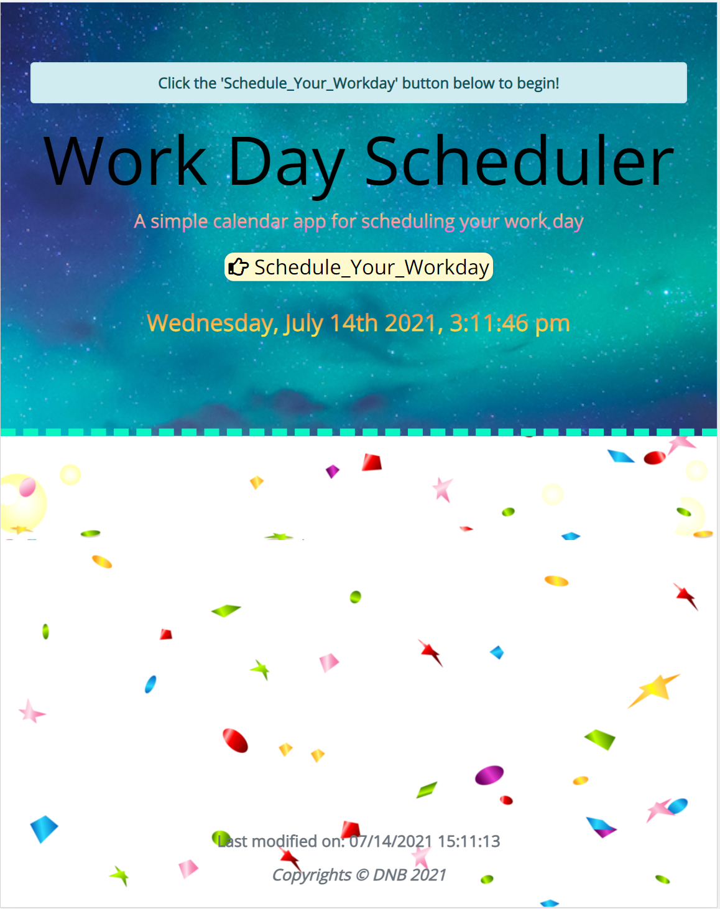
User Start Hour Prompt: 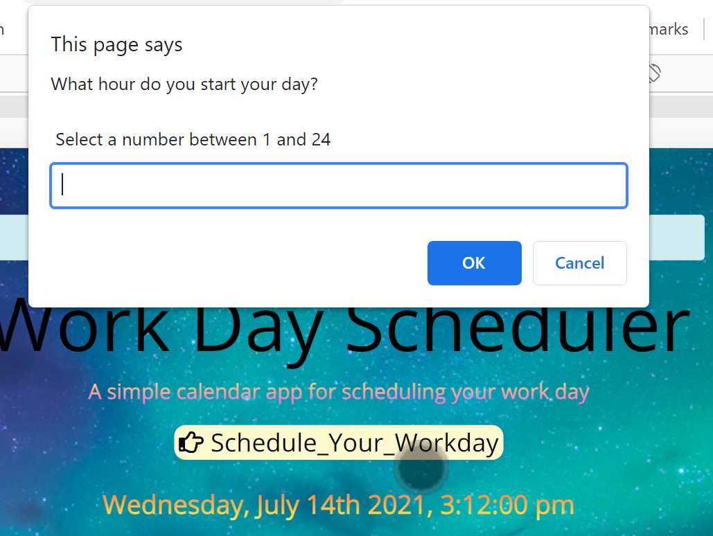
Start Hour Input Error: 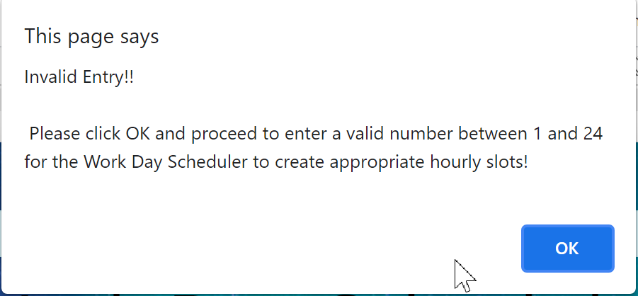
Start Hour Confirmation Prompt: 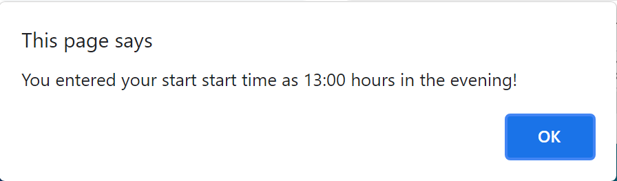
Dynamic Schedule Generated(Tablet View): 
Laptop View: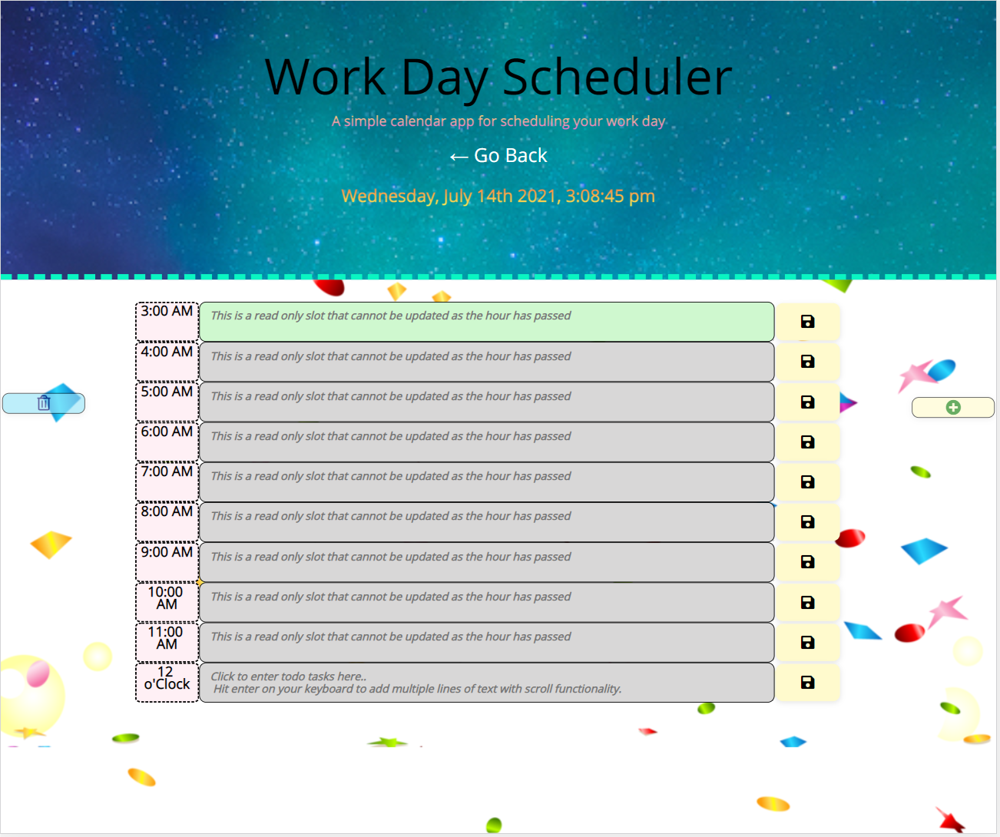
Mobile View:
Individual Entry Save Prompt: 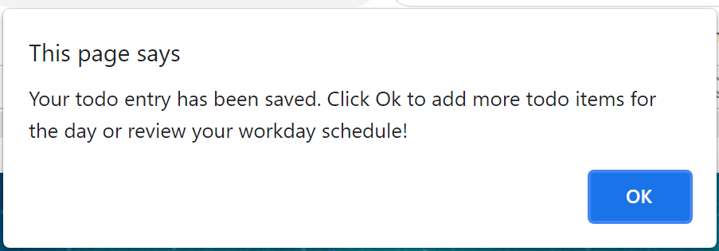
Cumulative Entry Save Function: 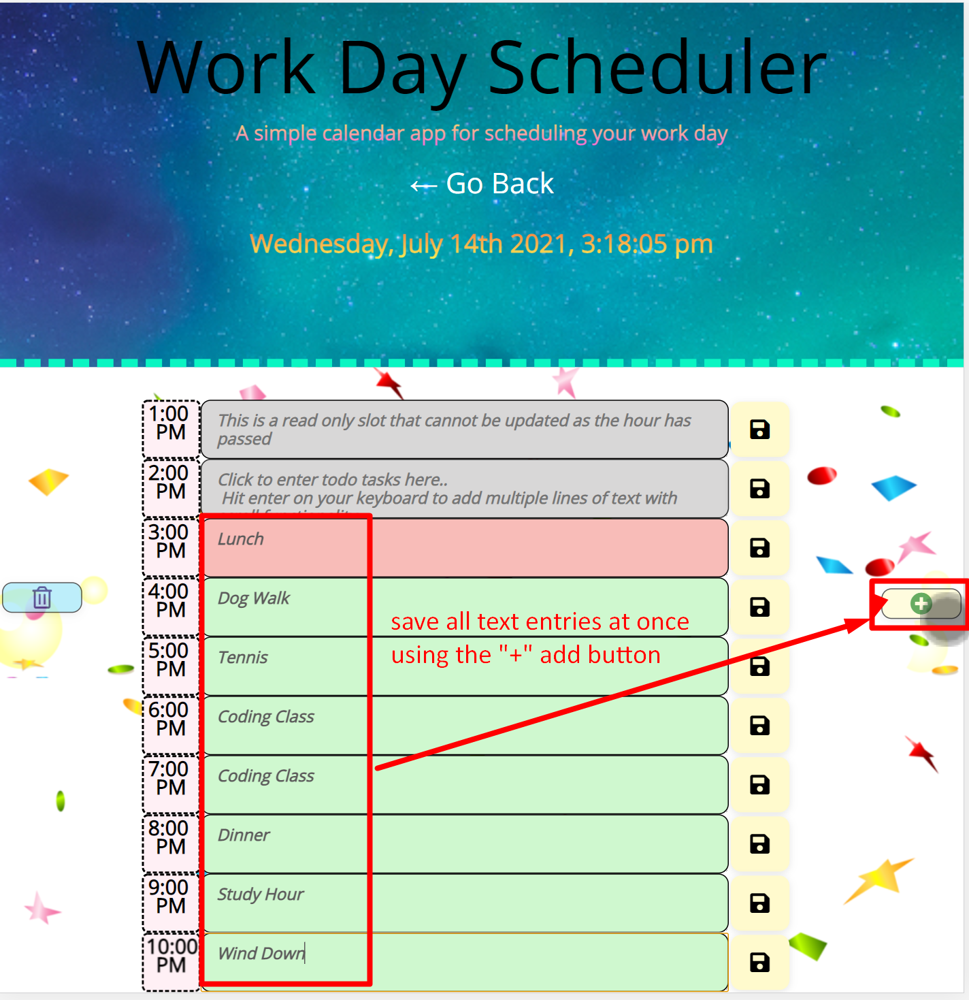
Local Data Persistence between Page Refreshes if Delete is not triggered - to get to this page you still need to enter a start hour be it the same or new hour: 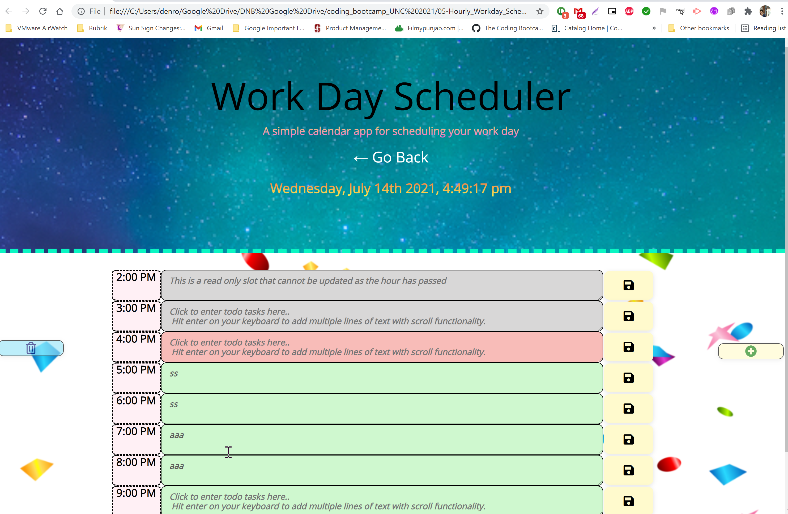
Local Browser Storage logic for the 2 save implementations: 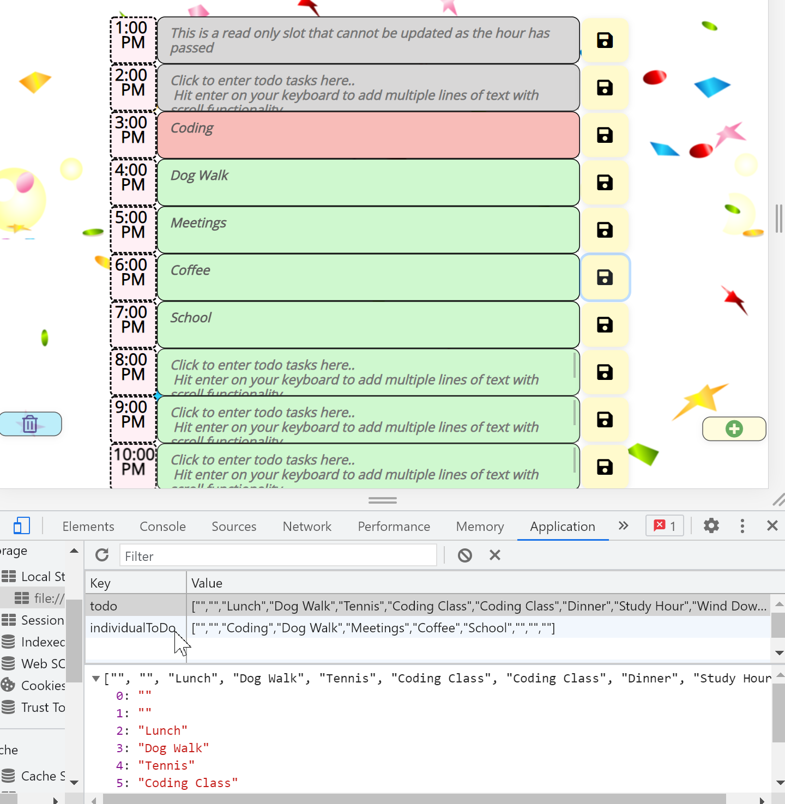
Clear All Text Entries for the existing Schedule: 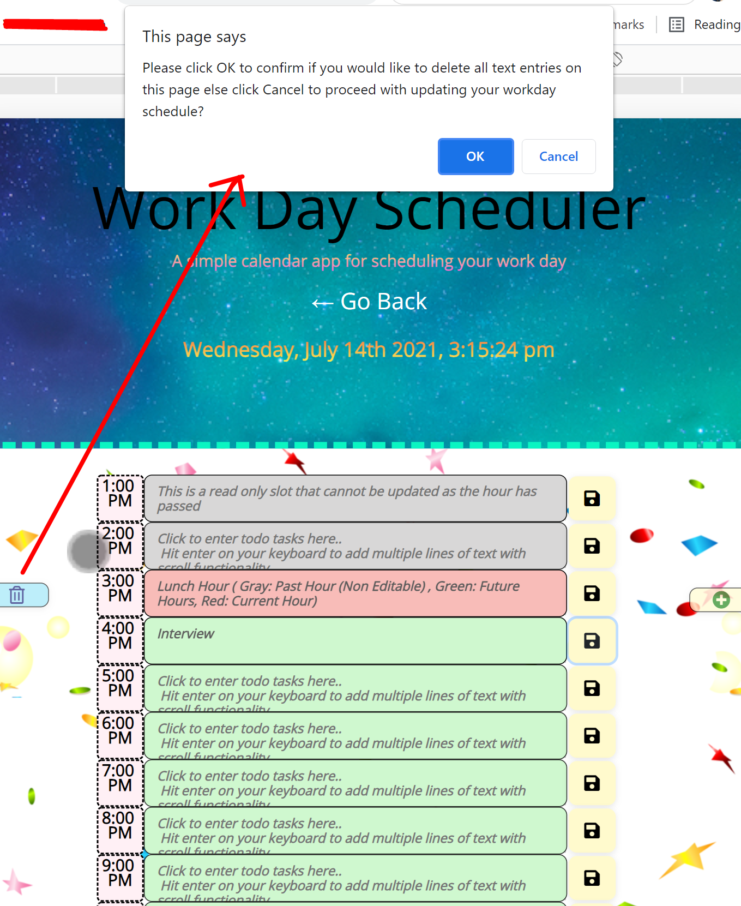


## Grading Requirements

This homework is graded based on the following criteria: 

### Technical Acceptance Criteria: 40%

```
✅ Satisfies all of the preceding acceptance criteria
✅ Uses a date utility library to work with date and time
```

### Deployment: 32%

```
✅ Application deployed at live URL.

✅ Application GitHub URL submitted.

✅ GitHub repository contains application code.

✅ Application loads with no errors.
```
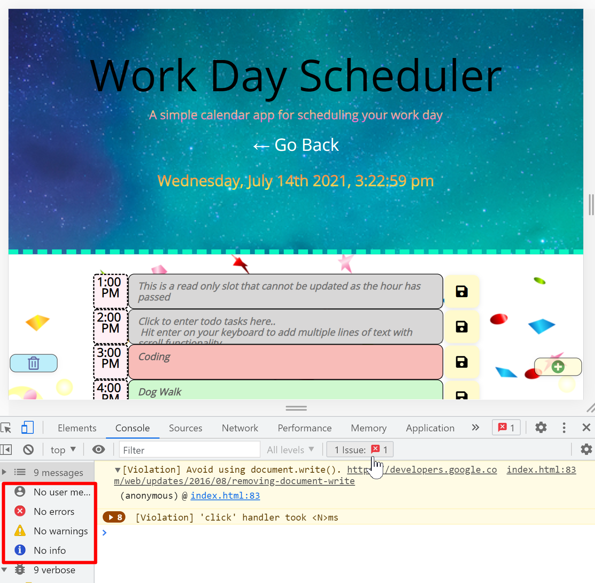

### Application Quality: 15%
```
✅ Application user experience is intuitive and easy to navigate.

✅ Application user interface style is clean and polished.

✅ Application resembles the mock-up functionality provided in the homework instructions.
```

### Repository Quality: 13%

```
✅ Repository has a unique name.

✅ Repository follows best practices for file structure and naming conventions.

✅ Repository follows best practices for class/id naming conventions, indentation, quality comments, etc.

✅ Repository contains multiple descriptive commit messages.

✅ Repository contains quality readme file with description, screenshot, and link to deployed application.
```